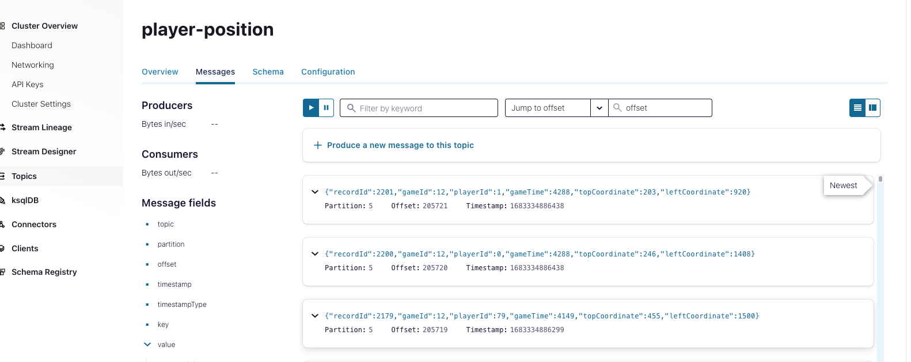
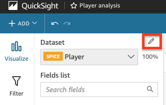
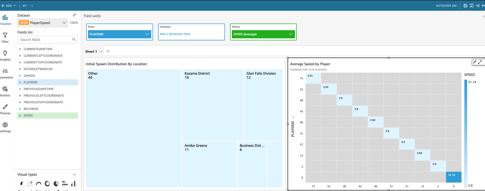
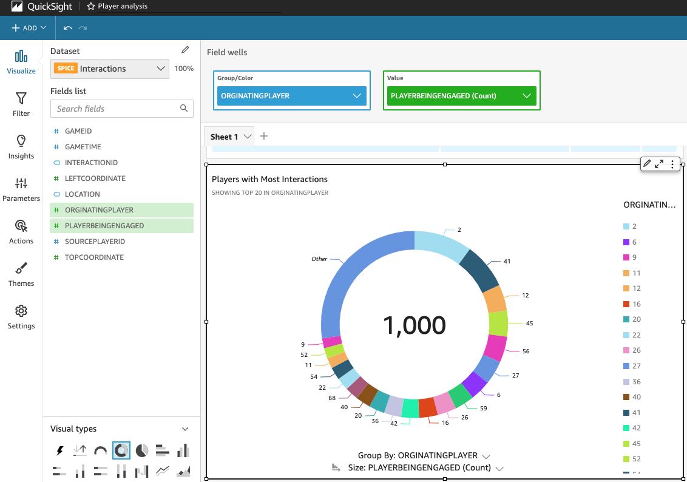
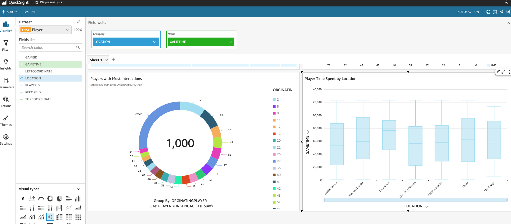

# Gaming-Analytics-With-Confluent-And-AWS
Create a data streaming pipeline for a video game simulation. Experience real time data processing for better and faster decision making. In this workshop, you will run a local client that will simulate player movements. Player coordinates as well as player collisions (labelled as interactions) are sent to Confluent Cloud for processing. You will also deploy a MongoDB Atlas database that contains static player information and source its data using a Confluent source connector. With data coming in from both the local client and MongoDB Atlas, you will create real time transformations to identify cheaters, track hot spots on the map, etc.


<br>


# Requirements
1. Confluent Cloud account
1. AWS Account with S3 and QuickSight permissions
1. An S3 bucket
1. Workshop Time: ~ 45 min

# Optional 
1. MongoDB Account

# Setting Up Confluent Cloud
1. Log into [confluent.cloud](https://confluent.cloud)
2. Create a new environment
3. Create a new Standard cluster. Select us-east-2 for the region.
4. Create API Keys (also known as Kafka API Keys within Confluent Cloud). These will allow the local client to interact (sink and source data) with Confluent Cloud.
5. Create a ksqlDB application. We will use this later for real-time transformations on the data that comes in.
6. Create a new topic called `interactions`. Leave the partitions set to 6. This will be one of the places where data from the local client will land.
7. Create a new topic called `player-position`. Leave the partitions set to 6. This will be one of the places where data from the local client will land.


# Run the Local Client
## Setup
1. Rename the file named `example-client.properties` to `client.properties`. This file will be used by the local client to push game data into Confluent Cloud.
1. Fill out the the `client.properties` file for the following fields:
    - bootstrap.servers: to find this value, navigate to your cluster in Confluent Cloud. Find the cluster settings tab and find the `Bootstrap server` label.
    - sasl.username: This is the Key of your Kafka API Keys you created earlier.
    - sasl.password: This is the Secret of your Kafka API keys you created earlier.

1. Run the following command: `python3 run-game-simulation.py`

## View the Incoming Messages
1. Log into Confluent Cloud and navigate to your cluster for this workshop
1. Navigate to the Topics section and click `player-position`
1. Click the `Messages` tab. If you have everything properly configured, you will see messages flow into the topic

1. You can choose to do the same with the `interactions` topics
1. \[Optional\] Feel free to pause the python script from above while you work on the next section.


# Real Time Transformation
With data flowing from the local game client into the Confluent Cloud, we will now perform real time transformations on the data as it comes in. Such transformations include joining data from multiple sources, filtering data by value, or routing data based on conditions. By doing so, we leverage the full potential of the once-siloed data to answer questions such as "which players are cheating?" or "where on the map are most players engaging?"

In ksqlDB, you will see two entities. Tables and streams. View this [link](https://developer.confluent.io/learn-kafka/ksqldb/streams-and-tables/) to learn about the differences before moving foward. 

1. Go to the ksqlDB application
1. **Create streams.** These command take the Kafka topics and turn them into streams in ksqlDB. Think of this as bringing the data into ksqlDB in a form that can be manipulated in real-time.

    ```
    CREATE STREAM player_stream (
        recordId INT,
        gameId INT,
        playerId INT,
        gameTime INT,
        topCoordinate INT,
        leftCoordinate INT
    )
        WITH (
            KAFKA_TOPIC = 'player-position',
            VALUE_FORMAT = 'JSON'
        );


    CREATE STREAM interactions_stream (
        interactionId STRING,
        gameId INT,
        gameTime INT,
        sourcePlayerId INT,
        player1Id INT,
        player2Id INT

    )
        WITH (
            KAFKA_TOPIC = 'interactions',
            VALUE_FORMAT = 'JSON'
        );

    ```
1. **Create Enriched Streams.**  This is where we will start joining the data. The `enriched_interactions_stream` joins the interaction stream and the player stream. The output provides interaction records with coordinates that identify where the engagement occurred on the map. Furthermore, the query utilizes a `CASE` statement to label sections of the map.
    ```
    
    CREATE STREAM enriched_interactions_stream WITH (
        KAFKA_TOPIC = 'enriched_interactions_stream'
    ) AS 

    select 
    a.Interactionid,
    b.gameid as gameId,
    b.GAMETIME as GameTime,
    AS_VALUE(a.sourcePlayerId) as SourcePlayerId,
    a.player1Id as orginatingPlayer,
    a.player2Id as playerBeingEngaged,
    b.playerid,
    b.leftCoordinate,
    b.topCoordinate,
    CASE 
        WHEN b.LEFTCOORDINATE > 75 AND b.LEFTCOORDINATE < 450 AND b.TOPCOORDINATE > 375 AND b.TOPCOORDINATE < 450 THEN 'The Bridge'
        WHEN b.LEFTCOORDINATE > 400 AND b.LEFTCOORDINATE < 850 AND b.TOPCOORDINATE > 100 AND b.TOPCOORDINATE < 400 THEN 'Downtown'
        WHEN b.LEFTCOORDINATE > 425 AND b.LEFTCOORDINATE < 925 AND b.TOPCOORDINATE > 500 AND b.TOPCOORDINATE < 800 THEN 'Business District'
        WHEN b.LEFTCOORDINATE > 1000 AND b.LEFTCOORDINATE < 1200 AND b.TOPCOORDINATE > 200 AND b.TOPCOORDINATE < 850 THEN 'Amiko Greens'
        WHEN b.LEFTCOORDINATE > 1300 AND b.LEFTCOORDINATE < 1800 AND b.TOPCOORDINATE > 0 AND b.TOPCOORDINATE < 500 THEN 'Glen Falls Division'
        WHEN b.LEFTCOORDINATE > 1300 AND b.LEFTCOORDINATE < 1800 AND b.TOPCOORDINATE > 500 AND b.TOPCOORDINATE < 1100 THEN 'Kasama District'
        ELSE 'Other'

    END AS Location
    from INTERACTIONS_STREAM a
    INNER JOIN PLAYER_STREAM b
    WITHIN 1 HOURS on a.sourcePlayerId = b.playerid 
    where a.gametime = b.gametime
    and a.gameId = b.gameId
    EMIT CHANGES;
    ```
    
    The `enriched_player_stream`, much like the `enriched_interactions_stream`, creates reader-friendly labels for sections of coordinates. This stream provides where a coordinates and location of a player for a given point in time of the match (note: GameTime is number of milliseconds since the game simulation was initialized).


    CREATE STREAM enriched_player_stream WITH (
                KAFKA_TOPIC = 'enriched_player_stream'
            )AS
    SELECT *, 
        CASE 
            WHEN LEFTCOORDINATE > 75 AND LEFTCOORDINATE < 450 AND TOPCOORDINATE > 375 AND TOPCOORDINATE < 450 THEN 'The Bridge'
            WHEN LEFTCOORDINATE > 400 AND LEFTCOORDINATE < 850 AND TOPCOORDINATE > 100 AND TOPCOORDINATE < 400 THEN 'Downtown'
            WHEN LEFTCOORDINATE > 425 AND LEFTCOORDINATE < 925 AND TOPCOORDINATE > 500 AND TOPCOORDINATE < 800 THEN 'Business District'
            WHEN LEFTCOORDINATE > 1000 AND LEFTCOORDINATE < 1200 AND TOPCOORDINATE > 200 AND TOPCOORDINATE < 850 THEN 'Amiko Greens'
            WHEN LEFTCOORDINATE > 1300 AND LEFTCOORDINATE < 1800 AND TOPCOORDINATE > 0 AND TOPCOORDINATE < 500 THEN 'Glen Falls Division'
            WHEN LEFTCOORDINATE > 1300 AND LEFTCOORDINATE < 1800 AND TOPCOORDINATE > 500 AND TOPCOORDINATE < 1100 THEN 'Kasama District'
            ELSE 'Other'

        END  AS Location
        FROM  player_stream 
        EMIT CHANGES;

1. **Create Player Speed Stream.**  Get ready for some ksqlDB magic. We are going to calculate the speed of players. As you may remember, the way to do that is to divide the distance traveled by amount of time passed. This essentially requires us to be able to take records two at a time in order to calculate both the change in distance and change in time. The following queries you are about to see is a stroke of genius as they do just that. The first stream duplicates the `player_stream` with one exception: it reduces the recordId by 100. We will use this edited recordId to join with a player's previous record combining the current and previous positions into a single record.
    ```   
    CREATE STREAM PLAYER_STREAM_current_location WITH (
            KAFKA_TOPIC = 'player_stream_current_location'
        )AS
    SELECT recordId - 100 as recordId,
    gameId,
    playerId,
    gameTime as currentGameTime,
    topCoordinate as currentTopCoordinate,
    leftCoordinate as currentLeftCoordinate

    FROM  player_stream 
        EMIT CHANGES;
    ```
    The following calculates the player's speed. The distance is calculated with the formula $\sqrt{(x<sub>1</sub>-x<sub>2</sub>)<sup>2</sup>+(y<sub>1</sub>-y<sub>2</sub>)<sup>2</sup>} and the coordinates from the current and previous player record. The delta of time is calculated from the current and previous record GameTime. Note: This is how we will be able to identify if there are any cheaters; if there is a player moving faster than others, we have good reason to suspet cheating.
    ```
        
    CREATE STREAM player_speed WITH (
            KAFKA_TOPIC = 'player_speed'
        )AS
        SELECT 
        a.recordId as recordId,
        a.gameId as gameId,
        AS_VALUE(b.playerId) as playerId,
        a.playerId,
        a.gameTime as previousGametime,
        a.topCoordinate as previousTopCoordinate,
        a.leftCoordinate as previousLeftCoordinate,
    currentGameTime, currentTopCoordinate, currentLeftCoordinate,
    sqrt((currentLeftCoordinate-previousLeftCoordinate)*(currentLeftCoordinate-previousLeftCoordinate)+(topCoordinate-previousTopCoordinate)*(topCoordinate-previousTopCoordinate)) as distanceTraveled,
    abs(sqrt((leftCoordinate-previousLeftCoordinate)*(leftCoordinate-previousLeftCoordinate)+(topCoordinate-previousTopCoordinate)*(topCoordinate-previousTopCoordinate))/(gameTime-previousGametime)*100) as speed
    FROM  player_stream a
        INNER JOIN player_stream_current_location b
        WITHIN 1 HOURS on a.playerid = b.playerid
        where a.recordId = b.recordId
        and a.gameId = b.gameId
        
    EMIT CHANGES;
    ```
## Watch the data transform in real time
1. Start up the `run-game-simulation.py` again if you had stopped it earlier. 
1. Navigate to ksqlDB and run the following query:
    ```
    select * from player_speed;
    ```
    
    The data will appear below the query window. Feel free explore the newly transformed messages.
    
1. Stop the above query then run the next query:
    ```
    select * from enriched_player_stream;
    ```
1. Stop the previous query and run this final statement:
    ```
    select * from enriched_interactions_stream; 
    ```
1. With each of these statements, remember that this data is being transformed in real time. Your data is ready for use by downstream systems before it even gets there. 


# Sinking Prepared Data to S3
## Prepare the S3 Bucket
1. Navigate to your S3 bucket
1. Edit the manifests found in the `quicksight-manifests`
    - Rename the file by removing the `example-` prefix on each file 
    - Replace the {YOUR_BUCKET_NAME} value with your bucketname
1. Upload all 3 edited manifests to the root of the S3 bucket; one manifest for each stream we intend to sink to S3.

## Deploy the Sink Connector
1. Select the connector tab
1. Click `+ Add Connector`
1. Search for `Amazon S3 Sink`
1. Select the following topics to be sinked to S3:
    - enriched_interactions_stream
    - enriched_player_stream
    - player_speed
1. Select New or Existing Kafka AI Keys (This allows your connector to interact with your Kafka Clusters)
1. Input your AWS API keys as well as the name of the bucket you intend to use
1. On the configuration page, use the following values:
    - Input Kafka record value format: JSON
    - Output message format: JSON
    - Time interval: HOURLY
1. Connector Sizing: 4
1. Review and Launch

## \[Optional\] Check Data in S3
1. Navigate to your S3 bucket and ensure it contains the following paths:
    - topics/enriched_interactions_stream/
    - topics/enriched_player_stream/
    - topics/player_speed/
 

# Visual Data in QuickSight
## Setup
1. Navigate to QuickSight
1. Go to the DataSet tab
1. Click `New Dataset`
1. Select the S3 option and use the following values to import data from S3 into QuickSight:
    - Data Source Name: Player
    - URL: s3://{YOUR_BUCKET_NAME_HERE}/manifest-player.json
1. Create 2 more datasets using the same S3 option and the following values

    - **Interactions Dataset**
        - Data Source Name: Interactions
        - URL: s3://aws-gameday-dev/manifest-interactions.json
    - **Player Speed Dataset**
        - Data Source Name: Player Speed
        - URL: s3://aws-gameday-dev/manifest-player_speed.json
## Create the Analysis
1. Navigate to QuickSight
1. Create a New Analysis
1. Click the `Player` Dataset
1. Click `Use in Analysis`
1. Click the Edit button near the Dataset.
    
    
1. Add the other two datasets: `Interactions` and `Player Speed`
1. Use the screenshots below to create the visuals for yourself.
    
    **Initial Spawn Visual.** This answers the question "Where are most players spawning at the beginning of the game? Do we need to consider a different distribution"
    

    **Average Speed Visual.** This helps identify if there are players moving faster than others (and indicator of cheating). As you can see in this visual and our dataset, Player 0 is moving 6x faster than other players.
    

    **Most Interactions.** This answers the question "Which players interact the most with other players?". This can help create player "style profiles" where in developers can understand players based on their style of play. It can also be a core component in matchmaking. The more interactions, the better the player. Players with interactions much higher than those in the same match problably need to be allocated to a batch of players that are on the same level.
    

    **Locations Visual.** This answers the question "Where are most player throughout the game?" For example, we can see that towards the end game of the match, most players were in the Business District and Other. Alternatively, at the beginning of the match, most players were at Amiko Greens.

    
    


# [Optional] Setting Up MongoDB
1. Login in to [cloud.mongodb.com](https://cloud.mongodb.com)
2. Add Network Access for Confluent Connector. This allows Confluent Cloud to source data from MongoDB Atlas.
3. Create a Database Access user for MongoDB. Save the username/passwords as they will be used later on for the Confluent Cloud connector.
4. Create a New MongoDB cluster. Dedicated or Shared will work. Select `us-east-2` for the region. Note: The MongoDB cluster and the Confluent Cloud cluster must be in the same region. 
5. Give the Cluster Name as "GameTech". 
6. Create a database called "Game"
7. Create a collection called "Location"
8. Insert the following documents:
    ```
    {
        "locationId": 1,
        "locationName": "The Bridge",
        "leftMin": 75,
        "leftMax" : 450,
        "topMin" : 375,
        "topMax": 450
    }
    {
        "locationId": 2,
        "locationName": "Downtown",
        "leftMin": 400,
        "leftMax" : 850,
        "topMin" : 100,
        "topMax": 400
    }
    {
        "locationId": 3,
        "locationName": "Business District",
        "leftMin": 425,
        "leftMax" : 925,
        "topMin" : 500,
        "topMax":800
    }
    {
        "locationId": 4,
        "locationName": "Amiko Greens",
        "leftMin": 1000,
        "leftMax" : 1200,
        "topMin" : 200,    "topMax":850
    }
    {
        "locationId": 5,
        "locationName": "Glen Falls Division",
        "leftMin": 1300,
        "leftMax" : 1800,
        "topMin" : 0,
        "topMax":500
    }
    {
        "locationId": 6,
        "locationName": "Kasama District",
        "leftMin": 1300,
        "leftMax" : 1800,
        "topMin" : 500,
        "topMax": 1100
    }
    ```
<br>

# Confluent/MongoDB Integration
1. In Confluent Cloud, create a MongoDB Connector navigating to the Connectors section of your Confluent Cloud cluster. 
1. Click `+ Add Connector`
1. Search for and select `MongoDB Atlas Source`
1. For topic prefix input: `Mongo`
1. For Kafka Credentials, simply create a new Global Access key using the button shown below 
1. The next page you will input MongoDB information. 
    ``` 
    Connection Host: <add your MongoDB host name. Format looks like the following: gametech.xxxxx.mongodb.net>
    Connection User: <add user you created in the MongoDB section>
    Connection Password: <add password of user you created in the MongoDB section>
    Database Name: Game
    Collection Name: Location
    ```
1. Output Kafka record value format should be set to JSON
1. Under the advanced settings, set the following:
    ```
    Publish full document only: true
    Copy existing data: true
    ```
1. Set your Task sizing to 1
1. Launch the connector
1. When the connector has successfully provisioned, navigate to the Topics tab
1. Look at the messages within `Mongo.Game.Location`. Depending on timing, it may be easier to set the `Jump to offset` to 0. You should see data regarding the game locations and its range of coordinates

<br>
