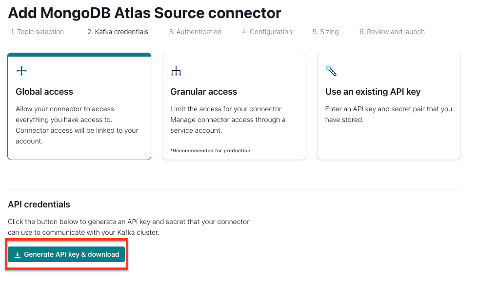

# Gaming-Analytics-With-Confluent-And-AWS
Create a data streaming pipeline for a video game simulation. Experience real time data processing for better and faster decision making. In this workshop, you will run a local client that will simulate player movements. Player coordinates as well as player collisions (labelled as interactions) are sent to Confluent Cloud for processing. You will also deploy a MongoDB Atlas database that contains static player information and source its data using a Confluent source connector. With data coming in from both the local client and MongoDB Atlas, you will create real time transformations to identify cheaters, track hot spots on the map, etc.


<br>


# Requirements
1. Confluent Cloud account
2. MongoDB account
3. Workshop Time: ~ 45 min

<br>

# Setting Up Confluent Cloud
1. Log into confluent.cloud
2. Create a new environment
3. Create a new cluster (basic cluster will be fine). Select us-east-2 for the region.
4. Create Kafka API Keys
5. Create a ksqlDB application
6. Create an interactions topic
7. Create player-position topic


<br>

# Setting Up MongoDB
1. Login in to cloud.mongodb.com  
2. Add Network Access for Confluent Connector. This allows Confluent Cloud to source data from MongoDB Atlas.
3. Create a Database Access user for MongoDB. Save the username/passwords as they will be used later on for the Confluent Cloud connector.
4. Create a New MongoDB cluster. Dedicated or Shared will work. Select `us-east-2` for the region. Note: The MongoDB cluster and the Confluent Cloud cluster must be in the same region. 
5. Give the Cluster Name as "GameTech". 
6. Create a database called "Game"
7. Create a collection called "Location"
8. Insert the following documents:
    ```
    {
        "locationId": 1,
        "locationName": "The Bridge",
        "leftMin": 75,
        "leftMax" : 450,
        "topMin" : 375,
        "topMax": 450
    }
    {
        "locationId": 2,
        "locationName": "Downtown",
        "leftMin": 400,
        "leftMax" : 850,
        "topMin" : 100,
        "topMax": 400
    }
    {
        "locationId": 3,
        "locationName": "Business District",
        "leftMin": 425,
        "leftMax" : 925,
        "topMin" : 500,
        "topMax":800
    }
    {
        "locationId": 4,
        "locationName": "Amiko Greens",
        "leftMin": 1000,
        "leftMax" : 1200,
        "topMin" : 200,    "topMax":850
    }
    {
        "locationId": 5,
        "locationName": "Glen Falls Division",
        "leftMin": 1300,
        "leftMax" : 1800,
        "topMin" : 0,
        "topMax":500
    }
    {
        "locationId": 6,
        "locationName": "Kasama District",
        "leftMin": 1300,
        "leftMax" : 1800,
        "topMin" : 500,
        "topMax": 1100
    }
    ```
<br>

# Confluent/MongoDB Integration
1. In Confluent Cloud, create a MongoDB Connector navigating to the Connectors section of your Confluent Cloud cluster. 
1. Click `+ Add Connector`
1. Search for and select `MongoDB Atlas Source`
1. For topic prefix input: `Mongo`
1. For Kafka Credentials, simply create a new Global Access key using the button shown below 
1. The next page you will input MongoDB information. 
    ``` 
    Connection Host: <add your MongoDB host name. Format looks like the following: gametech.xxxxx.mongodb.net>
    Connection User: <add user you created in the MongoDB section>
    Connection Password: <add password of user you created in the MongoDB section>
    Database Name: Game
    Collection Name: Location
    ```
1. Output Kafka record value format should be set to JSON
1. Under the advanced settings, set the following:
    ```
    Publish full document only: true
    Copy existing data: true
    ```
1. Set your Task sizing to 1
1. Launch the connector
1. When the connector has successfully provisioned, navigate to the Topics tab
1. Look at the messages within `Mongo.Game.Location`. Depending on timing, it may be easier to set the `Jump to offset` to 0. You should see data regarding the game locations and its range of coordinates

<br>

# Run the Local Client
1. Rename the file named `example-client.properties` to `client.properties` 
1. Fill out the the `client.properties` file for the following fields:
    ```
    bootstrap.servers
    sasl.username
    sasl.password
    ```
    bootstrap.servers: to find this value, navigate to your cluster in Confluent Cloud. Find the cluster settings tab and find the `Bootstrap server` label.

    sasl.username: This is the Key of your Kafka API Keys you created earlier.
    sasl.password: This is the Secret of your Kafka API keys you created earlier.

1. Run the following command: `python3 run-game-simulation.py`
1. Log into Confluent Cloud and navigate to your cluster for this workshop
1. Navigate to the Topics section and click `player-position`
1. Click the `Messages` tab. If you have everything properly configured, you will see messages flow into the topic
1. You can choose to do the same with the `interactions` topics


# Real Time Transformation
1. Go to the ksqlDB application
2. Create streams 
    ```

    CREATE STREAM player_data (
    recordId INT,
    gameId INT,
    playerId INT,
    gameTime INT,
    topCoordinate INT,
    leftCoordinate INT
    )
        WITH (
            KAFKA_TOPIC = 'player-position',
            VALUE_FORMAT = 'JSON'
        );


    CREATE STREAM interactions_stream (
    interactionId STRING,
    gameId INT,
    gameTime INT,
    playerId INT
    )
        WITH (
            KAFKA_TOPIC = 'interactions',
            VALUE_FORMAT = 'JSON'
        );
    ```
    3. Create locations table
    ```
    CREATE TABLE locations_tbl (
    locationId STRING PRIMARY KEY,
    locationName VARCHAR,
    leftMin INT,
    leftMax INT,
    topMin INT,
    topMAX INT
    )
        WITH (
            KAFKA_TOPIC = 'Mongo.Game.Location',
            VALUE_FORMAT = 'JSON'
        );
    ```
4. Create Enriched Streams
    ```
    CREATE STREAM locations_enriched
        WITH (
            KAFKA_TOPIC = 'enriched_locations_stream'
        ) AS 

    select 
    a.Interactionid,
    b.gameid,
    b.GAMETIME,
    b.playerid,
    b.leftCoordinate,
    b. topCoordinate
    from INTERACTIONS_STREAM a
    INNER JOIN DATA_PLAYER b
    WITHIN 1 HOURS on a.playerid = b.playerid 
    where a.gametime = b.gametime
    and a.gameId = b.gameId
    EMIT CHANGES;


    CREATE STREAM locations_enriched
        WITH (
            KAFKA_TOPIC = 'enriched_locations_stream'
        ) AS 

    select 
    a.Interactionid,
    b.gameid,
    b.GAMETIME,
    b.playerid,
    b.leftCoordinate,
    b. topCoordinate
    from INTERACTIONS_STREAM a
    INNER JOIN DATA_PLAYER b
    WITHIN 1 HOURS on a.playerid = b.playerid 
    INNER JOIN LOCATIONS_TBL c 
    ON a
    where a.gametime = b.gametime
    and a.gameId = b.gameId
    EMIT CHANGES;
    ```

